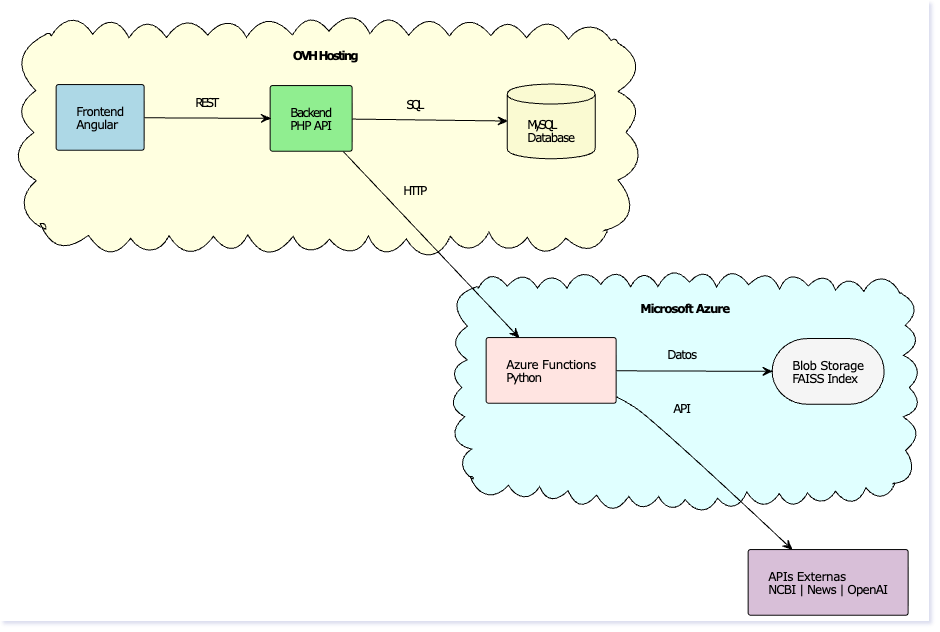
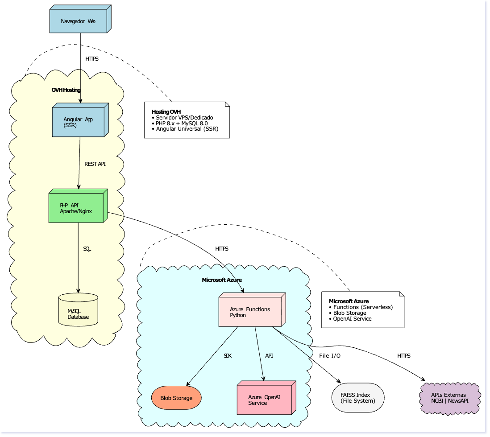
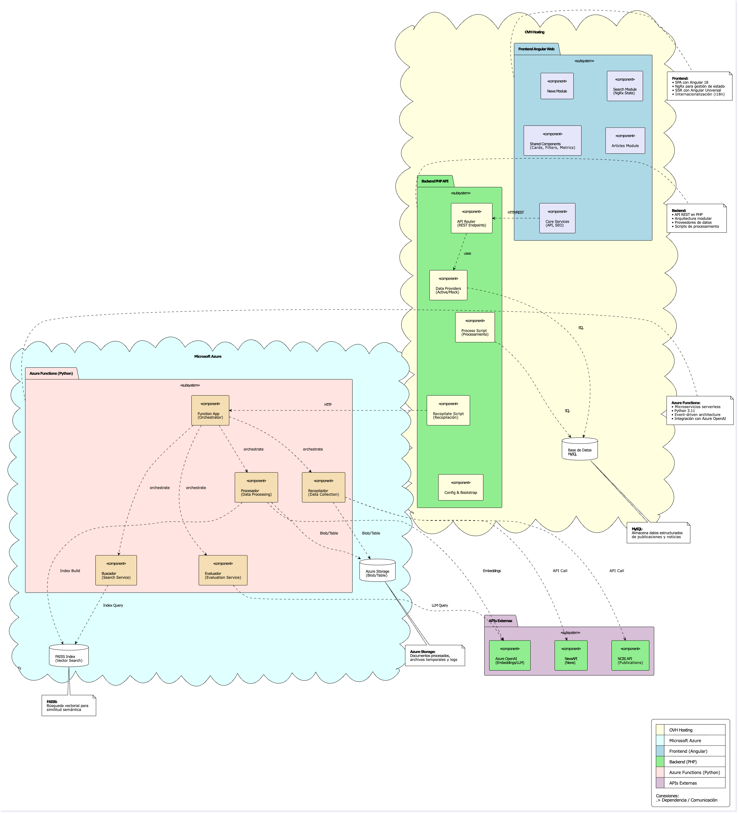
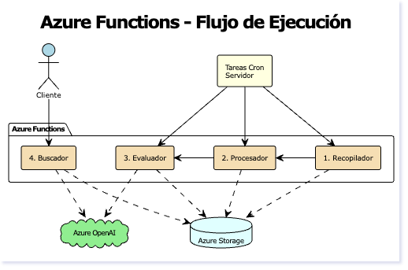

# NeuroFinder – Plataforma de inteligencia clínica para demencias

> Consulta esta documentación en inglés: [README_en.md](README_en.md)

NeuroFinder es una plataforma de investigación que centraliza evidencias clínicas sobre demencias y ofrece un buscador semántico accesible tanto para profesionales sanitarios como para cuidadores. El proyecto está compuesto por tres módulos principales que trabajan en conjunto:

## Recursos públicos

- **Dominio de la aplicación**: [`www.neurofinder.org`](https://www.neurofinder.org)
- **Diseño en Figma**: [`NeuroFinder`](https://www.figma.com/design/Nb5zOGw6UgJkumD34uuzMO/NeuroFinder?node-id=0-1&t=pMxAYJ03iCaGBp0O-1)

## Arquitectura del sistema

### Vista de alto nivel



### Arquitectura detallada



### Componentes del sistema



### Azure Functions



## Módulos del sistema

- **Frontend SPA (`Front angular/web`)**: Aplicación Angular 18 que ofrece la experiencia de usuario completa (búsqueda semántica, resultados filtrados, detalle de artículos, noticias y métricas).
- **Backend PHP (`Back php/api`)**: API REST que actúa como orquestador, expone los endpoints públicos y coordina la lógica de negocio con Azure Functions y base de datos MySQL.
- **Azure Functions (`Functions Azure`)**: Funciones serverless en Python para recopilación de datos (NCBI, TheNewsAPI), procesamiento con IA, generación de embeddings y búsqueda semántica con FAISS.

## Estructura del repositorio

El proyecto está organizado en módulos independientes que se comunican entre sí:

- **[`Back php/`](Back%20php/README.md)** - API REST en PHP que orquesta las peticiones del frontend y coordina con Azure Functions y base de datos MySQL
- **[`Front angular/`](Front%20angular/README.md)** - Aplicación web Angular 18 con NgRx, internacionalización y SEO dinámico
- **[`Functions Azure/`](Functions%20Azure/README.md)** - Funciones serverless en Python para recopilación (NCBI, TheNewsAPI), procesamiento con IA, generación de embeddings y búsqueda semántica con FAISS
- **[`Pruebas/`](Pruebas/README.md)** - Notebooks Jupyter de experimentación y pruebas con servicios externos
- **[`Arquitectura/`](Arquitectura/)** - Diagramas de arquitectura en PlantUML y PNG

## Requisitos previos

- **Node.js 20 LTS** y npm 10 (para Angular CLI 18)
- **PHP 8.2** con extensión JSON y PDO habilitadas
- **Python 3.11+** y Azure Functions Core Tools v4
- **MySQL/MariaDB** (para modo `active` del backend)
- **Azure Storage** o Azure Storage Emulator (para ejecutar Functions)
- **Azure OpenAI** (para generación de embeddings y procesamiento con IA)

## Puesta en marcha local

### 1. Frontend Angular

```bash
cd "Front angular/web"
npm install
npm run start
```

La aplicación queda disponible en `http://localhost:4200`. Los entornos (`environment.ts`) están configurados para apuntar al backend en `http://localhost:8080/api`.

**Características disponibles:**
- Búsqueda semántica con filtros avanzados
- Visualización de artículos y noticias
- Internacionalización (español/inglés)
- SEO dinámico con metadatos Open Graph

### 2. Backend PHP

```bash
cd "Back php/api"
php -S localhost:8080 index.php
```

**Endpoints implementados:**

- `GET /health` - Estado del servicio (verifica BD y servicios)
- `GET /metrics` - Métricas agregadas (fuentes y artículos)
- `GET /news/latest?language={lang}&limit={n}` - Noticias recientes
- `GET /articles/latest?language={lang}&limit={n}` - Últimos artículos
- `POST /search` - Búsqueda de artículos (con query opcional y filtros)
- `POST /articles` - Detalle de artículo por URL
- `POST /report` - Reportar contenido (guarda en BD y envía email)
- `GET /docs` - Documentación interactiva (Swagger UI)
- `GET /openapi.yaml` - Especificación OpenAPI

**Configuración:**
- `APP_PROFILE`: Controla el origen de datos (`mock` por defecto, `active` para producción con BD y Azure Functions)
- `APP_BASE_PATH`: Define el prefijo de ruta si la API está en un subdirectorio (ej: `api`)
- Variables de entorno de BD: `DB_HOST`, `DB_PORT`, `DB_DATABASE`, `DB_USERNAME`, `DB_PASSWORD`
- Variables de Azure: `AZURE_SEARCH_URL` (para búsqueda semántica)

### 3. Azure Functions

```bash
cd "Functions Azure"
python -m venv .venv
source .venv/bin/activate  # En Windows: .venv\Scripts\activate
pip install -r requirements.txt
func start
```

**Funciones HTTP implementadas:**

- `GET /api/recopilador?week={week}&year={year}` - Recopila artículos de NCBI y noticias de TheNewsAPI
- `GET /api/procesamiento` - Compacta archivos JSON del storage
- `POST /api/evaluacion` - Construye índice FAISS con embeddings (recibe items en body)
- `GET /api/buscador?q={query}&k={limit}&tag={tag}` - Búsqueda semántica en FAISS

**Configuración requerida:**
- `AzureWebJobsStorage` o `AZURE_STORAGE_CONNECTION_STRING` - Conexión a Azure Storage
- `AZURE_OPENAI_ENDPOINT` - Endpoint de Azure OpenAI
- `AZURE_OPENAI_API_KEY` - Clave API de Azure OpenAI
- `THENEWSAPI_TOKEN` - Token de TheNewsAPI (para recopilación de noticias)
- `NCBI_API_KEY` - Clave API de NCBI (opcional, mejora límites de rate)

## Despliegue

### Frontend y Backend (Hosting OVH)

1. **Compilar frontend:**
   ```bash
   cd "Front angular/web"
   npm run build
   ```
   Esto genera la carpeta `dist/web` con archivos estáticos optimizados.

2. **Subir archivos:**
   - Subir `dist/web/*` al directorio `/www` del hosting
   - Subir `Back php/api/*` al directorio `/www/api`

3. **Configurar backend:**
   - Definir variables de entorno en `.htaccess` o configuración del servidor:
     - `APP_PROFILE=active` (para producción)
     - `APP_BASE_PATH=api`
     - Variables de BD: `DB_HOST`, `DB_DATABASE`, `DB_USERNAME`, `DB_PASSWORD`
     - Variables de Azure: `AZURE_SEARCH_URL`
   - Asegurar que el `.htaccess` redirige peticiones a `index.php`

### Azure Functions

```bash
cd "Functions Azure"
func azure functionapp publish <nombre-app>
```

**Configuración en Azure:**
- Configurar Application Settings con todas las variables de entorno requeridas
- Asegurar que el contenedor de Azure Storage existe (`recopilaciones` por defecto)
- Verificar que Azure OpenAI está configurado y accesible

## Características implementadas

### Frontend
- ✅ Búsqueda semántica con filtros avanzados (tipos de demencia, documentos, idiomas, fechas, score)
- ✅ Gestión de estado con NgRx (Store + Effects)
- ✅ Internacionalización completa (español/inglés)
- ✅ SEO dinámico con metadatos Open Graph y Twitter Cards
- ✅ Componentes reutilizables (article-card, filters-panel, metrics-banner, news-grid, report-modal)
- ✅ Optimizaciones de rendimiento (OnPush, lazy loading, cache)

### Backend PHP
- ✅ API REST completa con todos los endpoints implementados
- ✅ Modo `mock` para desarrollo y modo `active` para producción
- ✅ Integración con Azure Functions para búsqueda semántica
- ✅ Conexión a MySQL/MariaDB para almacenamiento y consultas
- ✅ Sistema de reportes con almacenamiento en BD y envío de emails
- ✅ Health check con verificación de servicios
- ✅ Sistema de scores de fiabilidad de fuentes
- ✅ Documentación OpenAPI con Swagger UI

### Azure Functions
- ✅ Recopilación de artículos de NCBI (PubMed) y noticias de TheNewsAPI
- ✅ Procesamiento con Azure OpenAI para extraer resúmenes, puntos clave y categorización
- ✅ Compactación de archivos JSON del storage
- ✅ Generación de embeddings con Azure OpenAI (`text-embedding-ada-002`)
- ✅ Construcción de índices FAISS para búsqueda semántica
- ✅ Búsqueda semántica con soporte para índices por tag
- ✅ Almacenamiento en Azure Blob Storage

## Tecnologías utilizadas

- **Frontend**: Angular 18, NgRx, Angular Material, @ngx-translate/core, RxJS
- **Backend**: PHP 8.2, PDO (MySQL), JSON
- **Azure Functions**: Python 3.11, FAISS, Azure OpenAI SDK, Biopython, NumPy
- **Base de datos**: MySQL/MariaDB
- **Almacenamiento**: Azure Blob Storage
- **IA**: Azure OpenAI (GPT para procesamiento, ada-002 para embeddings)

## Flujo de datos

### Búsqueda semántica

1. Usuario realiza búsqueda en el frontend Angular
2. Frontend envía petición `POST /search` al backend PHP
3. Backend PHP (modo `active`):
   - Si hay query: Llama a `GET /api/buscador` de Azure Functions
   - Azure Functions genera embedding de la query y busca en índice FAISS
   - Backend PHP recibe URLs de resultados y busca artículos en la BD
   - Si Azure falla: Fallback a búsqueda local en BD con LIKE
4. Si no hay query: Búsqueda directa en BD aplicando solo filtros
5. Resultados se devuelven al frontend y se muestran al usuario

### Recopilación y procesamiento

1. `GET /api/recopilador` obtiene artículos de NCBI y noticias de TheNewsAPI
2. Cada artículo/noticia se procesa con Azure OpenAI para extraer información estructurada
3. Resultados se guardan en Azure Blob Storage como archivos JSON
4. `GET /api/procesamiento` compacta archivos JSON pendientes
5. `POST /api/evaluacion` genera embeddings y construye índice FAISS
6. Índice FAISS se guarda en Azure Blob Storage para búsquedas futuras

## Documentación por módulo

Para entender en detalle cada parte del sistema y cómo se comunican:

- **[Backend PHP](Back%20php/README.md)** - API REST, orquestación, integración con BD y Azure Functions
- **[Frontend Angular](Front%20angular/README.md)** - Interfaz de usuario, NgRx, internacionalización y SEO
- **[Azure Functions](Functions%20Azure/README.md)** - Recopilación, procesamiento con IA, embeddings y búsqueda semántica
- **[Pruebas](Pruebas/README.md)** - Notebooks Jupyter de experimentación con servicios externos

## Diagramas de arquitectura

Los diagramas de arquitectura están disponibles en la carpeta [`Arquitectura/`](Arquitectura/):

- `diagrama_alto_nivel.png` - Vista general del sistema
- `diagrama_arquitectura.png` - Arquitectura detallada de componentes
- `diagrama_componentes.png` - Componentes y sus interacciones
- `diagrama_funciones_azure.png` - Flujo de Azure Functions

Los archivos fuente en PlantUML (`.puml`) también están disponibles para edición.

---

Para más detalles técnicos específicos consulta también los documentos `Explicacion.md` dentro de las carpetas `Back php` y `Front angular`. Cualquier duda adicional puede dirigirse al equipo responsable del TFM.

